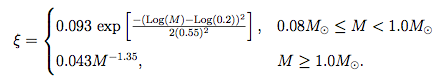
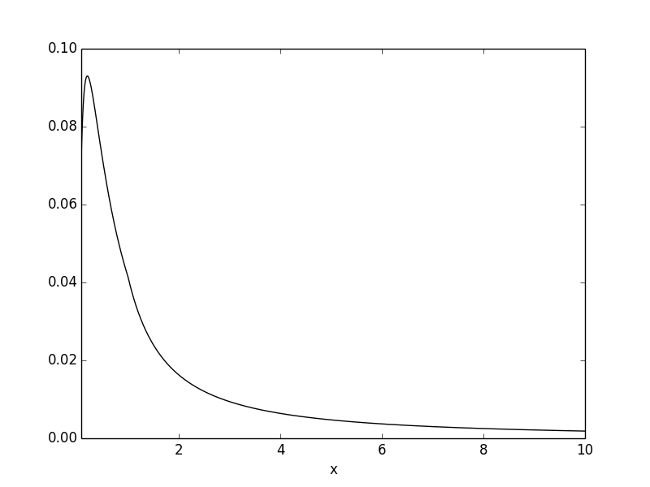
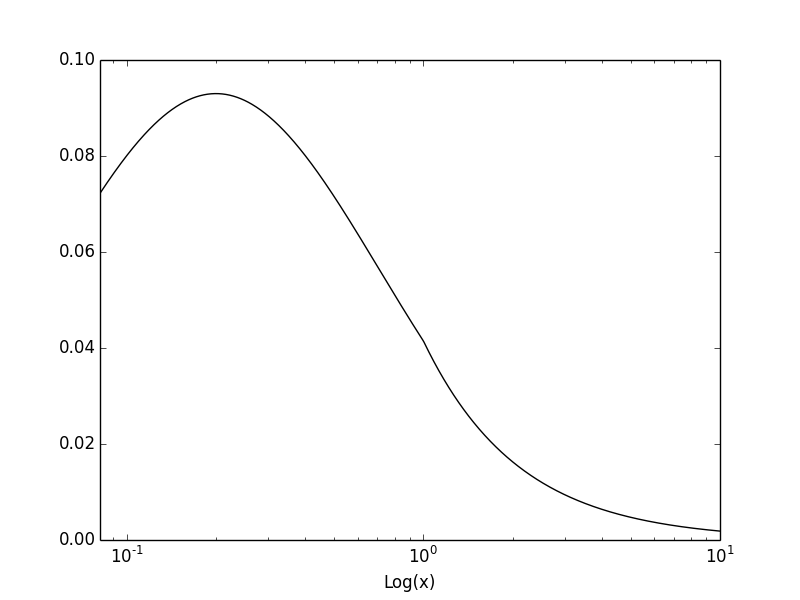
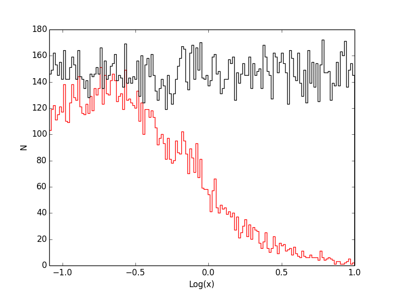

#rejection.py : Rejection Sampling for Custom Distributions

##Requirements

* > Python 2.6 or > Python 3.0
* Numpy
* Matplotlib

##Introduction

Attempting to sample from custom statistical distributions is a hassle especially if it's not well behaved or piecewise. A quick way to sample from a custon distribution requires knowledge of the cumulative distribution function which may not be available. In that case you can use rejection sampling to populate a random sample from a custom distribution.

##Installation

`
$ git clone https://github.com/astronomerdamo/pyreject.git
`

##Usage

For complete usage:

`
$ python rejection.py -h
`

##Example

If you were to take a census of the masses of stars in our part of the galaxy you would get a weird piecewise lognormal/power law distribution that looked like this:

Populating a random sample from this distribution requires a rejection sampling technique. The main program 'rejection.py' has this distribution built into the 'custom_df' class as an example.

So, to get a good look at this distribution without sampling it we can type

`
$ python rejection.py 0.08 10 -ex
`

note the '-ex' flag for explore which simply displays the distribution between the limits 0.08 and 10.

Functions like these are always better to view in logspace because sampling something like that linearly will take a lot of time. What does our custom distribution look like in log space?

`
$ python rejection.py -1.09 1 -lg -ex
`

So now we specify the limits as Log(0.08) and Log(10) and we need to tell the program these limits are Log by including the '-lg' flag.

This looks easier and more efficient to sample. Now we can create a randomly drawn sample from our distribution in logspace and write it to a .csv file.

`
$ python rejection.py -1.09 1 -lg -o
`

This command displays a histogram of the sampled distribution (red) along with the sample space (black) and also writes a file with 10000 randomly drawn points to 'rejection_output.csv' in the current directory.

